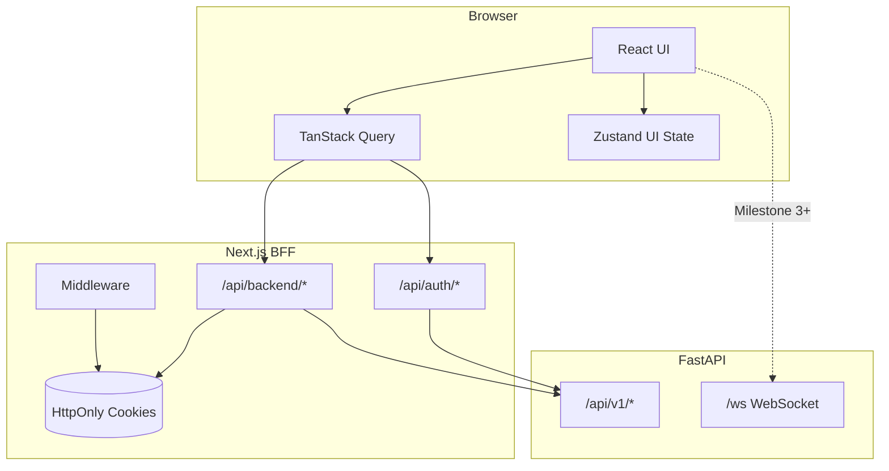

# CollabForge — Enterprise Collaboration Frontend

Production-ready Next.js frontend for the [CollabForge FastAPI backend](../python-fastapi/python-fastapi-enterprise-boilerplate). Built for workspaces, channels (Slack-style), boards (Trello-style), and documents (Notion-style).

## Tech Stack

| Layer        | Technology                                |
| ------------ | ----------------------------------------- |
| Framework    | Next.js 16, React 19, TypeScript (strict) |
| Styling      | Tailwind CSS 4, Shadcn UI, CVA            |
| Server state | TanStack Query                            |
| Client state | Zustand                                   |
| Forms        | React Hook Form + Zod                     |
| HTTP         | Axios (via BFF proxy)                     |
| Realtime     | Native WebSocket (Milestone 3+)           |
| Testing      | Vitest, RTL, Playwright E2E               |
| Monitoring   | Sentry (opt-in), OpenTelemetry (opt-in)   |
| Deployment   | Docker standalone + NGINX compose         |

## Architecture



### Why a BFF (Backend-for-Frontend)?

The FastAPI backend returns JWT bearer tokens in JSON. For enterprise security, tokens are **never exposed to JavaScript**. Next.js Route Handlers:

1. Exchange credentials with FastAPI
2. Store `access_token` + `refresh_token` in **HttpOnly cookies**
3. Proxy API calls with `Authorization: Bearer` injected server-side

**Trade-off:** Extra network hop through Next.js. **Benefit:** XSS cannot steal tokens; aligns with HttpOnly cookie strategy from enterprise security requirements.

### State Separation

| Concern         | Tool           | Examples                               |
| --------------- | -------------- | -------------------------------------- |
| Server state    | TanStack Query | User profile, workspaces, messages     |
| Client/UI state | Zustand        | Sidebar collapsed, theme prefs, modals |

## Folder Structure

```
src/
├── app/
│   ├── (auth)/              # Route group — public auth pages
│   │   ├── login/
│   │   ├── register/
│   │   └── forgot-password/
│   ├── (dashboard)/         # Route group — protected app shell
│   │   ├── dashboard/
│   │   └── workspaces/
│   └── api/
│       ├── auth/            # BFF auth (cookies)
│       └── backend/[...path] # BFF proxy to FastAPI
├── components/
│   ├── ui/                  # Shadcn primitives
│   ├── common/              # Logo, theme toggle, loaders
│   └── layout/              # App shell, sidebar
├── features/
│   ├── auth/                # Feature-isolated auth module
│   ├── workspaces/          # Workspaces CRUD + members + RBAC
│   ├── channels/            # Channels, messages, WebSocket realtime
│   ├── boards/              # Kanban boards, DnD cards, optimistic locking
│   ├── documents/           # Notion-style pages, blocks, collaborative edits
│   ├── command-palette/     # Global Cmd+K search and navigation
│   ├── notifications/       # Realtime notification center (Zustand + WS)
│   └── analytics/           # Dashboard stats and Recharts visualizations
├── providers/               # Query, theme, app providers
├── services/api/            # Axios client + interceptors
├── services/realtime/       # WebSocket client singleton
├── store/                   # Zustand stores (auth, ui, workspace, notifications)
├── config/                  # Env validation
├── constants/               # Routes, auth keys
├── types/                   # Shared TypeScript types
├── lib/auth/                # Server-side auth utilities
└── middleware.ts            # Protected route guards
```

## Installation

### Prerequisites

- Node.js 20+
- Running CollabForge FastAPI backend on `http://localhost:8000`

### Setup

```bash
cd next.js-enterprise-collaboration-dashboard
npm install
cp .env.example .env.local
npm run dev
```

Open [http://localhost:3000](http://localhost:3000)

### Backend CORS

Ensure the FastAPI `.env` includes:

```
CORS_ORIGINS=http://localhost:3000
```

## Environment Variables

| Variable                      | Default                  | Description                      |
| ----------------------------- | ------------------------ | -------------------------------- |
| `BACKEND_API_URL`             | `http://localhost:8000`  | FastAPI base URL (server-only)   |
| `BACKEND_API_V1_PREFIX`       | `/api/v1`                | API prefix                       |
| `NEXT_PUBLIC_APP_URL`         | `http://localhost:3000`  | Frontend URL                     |
| `NEXT_PUBLIC_WS_URL`          | `ws://localhost:8000/ws` | WebSocket endpoint               |
| `COOKIE_SECURE`               | `false`                  | Set `true` in production (HTTPS) |
| `NEXT_PUBLIC_SENTRY_DSN`      | —                        | Sentry DSN (optional)            |
| `OTEL_ENABLED`                | `false`                  | Enable OpenTelemetry when `true` |
| `OTEL_EXPORTER_OTLP_ENDPOINT` | —                        | OTLP HTTP traces endpoint        |

## Backend API Mapping

| Frontend feature | FastAPI endpoints                                                        |
| ---------------- | ------------------------------------------------------------------------ |
| Auth             | `POST /auth/login`, `/register`, `/refresh`, `/logout`, `GET /auth/me`   |
| Workspaces       | `GET/POST /workspaces`, `PATCH/DELETE /workspaces/{id}`, `/members` CRUD |

### Workspace RBAC (frontend mirrors backend)

| Action                        | Member | Admin | Owner        |
| ----------------------------- | ------ | ----- | ------------ |
| View workspace / members      | ✓      | ✓     | ✓            |
| Update workspace              |        | ✓     | ✓ (if admin) |
| Delete workspace              |        | ✓     | ✓ always     |
| Add / update / remove members |        | ✓     | ✓ (if admin) |
| Remove owner                  |        | ✗     | ✗            |

| Frontend feature | FastAPI endpoints                                                                |
| ---------------- | -------------------------------------------------------------------------------- |
| Channels         | `GET/POST /workspaces/{id}/channels`, messages with cursor pagination, `WS /ws`  |
| Boards           | `GET/POST /workspaces/{id}/boards`, lists, cards, `PATCH` with `version`         |
| Documents        | `GET/POST /workspaces/{id}/documents`, blocks CRUD, `version` optimistic locking |
| Realtime         | `WS /ws?token=` — subscribe to channel/board/document rooms                      |

### WebSocket (Milestone 3)

- Token via `GET /api/auth/ws-token` (reads HttpOnly cookie server-side)
- Client connects to `NEXT_PUBLIC_WS_URL?token=...`
- Actions: `subscribe`, `unsubscribe`, `typing`
- Events: `message.created`, `card.moved`, `document.updated`, `typing`, `subscribed`, `error`
- Document events: `title_updated`, `block_created`, `block_updated`, `block_deleted`
- Thread replies use `parent_id` on `POST .../messages`

### Command Palette (Milestone 6)

- **Shortcut:** `⌘K` / `Ctrl+K` or header search button
- Navigate workspaces, channels, boards, documents
- Quick actions: toggle sidebar, theme, sign out

### Notifications (Milestone 6)

- No dedicated backend notification API — client aggregates **WebSocket events** from subscribed rooms
- Persisted in Zustand (`collabforge-notifications`)
- Skips events when you're already viewing the source page or when you authored the action
- Mention detection via message `metadata.mentions` or `@email` in content
- Bell icon in header with unread badge

### Analytics (Milestone 6)

- Dashboard aggregates counts from existing workspace APIs
- Stats: workspaces, members, channels, boards, documents, cards
- Recharts bar chart (active workspace) + pie chart (workspace comparison)

### Docker + NGINX (Milestone 7)

```bash
# Requires FastAPI backend on host :8000
npm run docker:build
npm run docker:up
```

- **frontend** — Next.js standalone image (`docker/Dockerfile`)
- **nginx** — reverse proxy on port 80; proxies `/ws` to backend for WebSocket
- Health check: `GET /api/health`

### Monitoring (Milestone 7)

| Tool          | Env vars                                           | Notes                                         |
| ------------- | -------------------------------------------------- | --------------------------------------------- |
| Sentry        | `NEXT_PUBLIC_SENTRY_DSN`                           | Error + performance tracing (opt-in)          |
| OpenTelemetry | `OTEL_ENABLED=true`, `OTEL_EXPORTER_OTLP_ENDPOINT` | HTTP instrumentation via `instrumentation.ts` |

Both are **disabled by default** — no overhead in local dev without DSN/OTel endpoint.

### E2E Tests (Milestone 7)

Playwright specs in `e2e/`:

```bash
npm run test:e2e          # starts dev server automatically
npm run test:e2e:ui       # interactive UI mode
```

Set `E2E_USER_EMAIL` + `E2E_USER_PASSWORD` for authenticated flow tests (requires running backend).

### Git Hooks (Milestone 7)

Husky pre-commit runs `lint-staged` (Prettier + ESLint on staged files).

## Milestone Progress

- [x] **Milestone 1** — Foundation, BFF auth, login/register, app shell, dark mode
- [x] **Milestone 2** — Workspaces (CRUD, members, RBAC, switcher)
- [x] **Milestone 3** — Channels + WebSocket messaging (threads, typing, cursor pagination)
- [x] **Milestone 4** — Kanban boards (DnD Kit, optimistic locking, realtime moves)
- [x] **Milestone 5** — Documents + collaborative blocks (realtime sync, 7 block types)
- [x] **Milestone 6** — Command palette, notifications, analytics
- [x] **Milestone 7** — Docker, E2E tests, monitoring (Sentry/OTel)

## Scripts

```bash
npm run dev          # Development server
npm run build        # Production build
npm run start        # Production server
npm run lint         # ESLint
npm run format       # Prettier
npm run test         # Vitest unit tests
npm run test:e2e     # Playwright E2E
npm run test:e2e:ui  # Playwright UI mode
npm run docker:build # Build Docker images
npm run docker:up    # Start frontend + NGINX
```

## Security Notes

- Tokens stored in HttpOnly cookies (`cf_access_token`, `cf_refresh_token`)
- Silent refresh via Axios interceptor → `/api/auth/refresh`
- Multi-tab sync via `BroadcastChannel`
- Auto-logout on refresh failure
- Middleware guards protected routes before page render

## License

MIT
